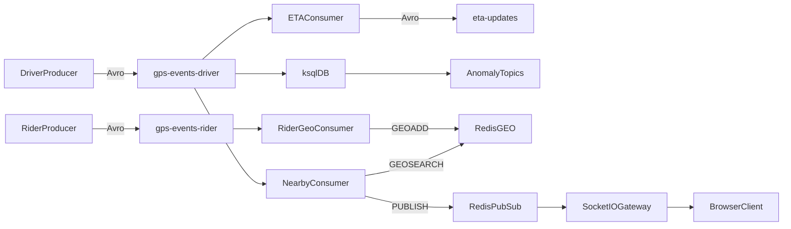

# RideStream

[](https://github.com/iikareem/ride-stream/actions/workflows/ci.yml)
[](https://nodejs.org/)
[](https://nestjs.com/)
[](docker-compose.yml)
[](https://avro.apache.org/)
[](https://redis.io/)

RideStream is a real-time event-processing system that models the location pipeline of a ride-sharing platform. It ingests simulated driver and rider GPS events, calculates ETAs, detects movement anomalies, finds nearby riders, and streams driver updates to a browser client.

The project uses a three-broker Apache Kafka cluster in KRaft mode, Avro contracts backed by Schema Registry, independent NestJS consumers, ksqlDB stream processing, Redis geospatial indexing and Pub/Sub, Socket.IO, and a Prometheus/Grafana monitoring stack.

**Status:** complete learning system for local Kafka stream processing, replication, and live fan-out.

## Contents

- [Features](#features)
- [Architecture](#architecture)
- [Processing model](#processing-model)
- [Technology stack](#technology-stack)
- [Getting started](#getting-started)
- [Run the pipeline](#run-the-pipeline)
- [Configure ksqlDB](#configure-ksqldb)
- [Observability](#observability)
- [Cluster verification](#cluster-verification)
- [Configuration](#configuration)
- [Scope and limitations](#scope-and-limitations)
- [Additional documentation](#additional-documentation)

## Features

- Three-broker Kafka cluster with replication factor 3
- Six partitions per application topic
- `min.insync.replicas=2` with unclean leader election disabled
- Driver and rider GPS simulation
- Avro serialization with backward-compatible schema evolution
- Per-driver ordering through keyed Kafka messages
- Transactional ETA processing with atomic output and offset commits
- Speed, teleport, and GPS-freeze anomaly detection in ksqlDB
- Tumbling and hopping window aggregations
- Redis GEO indexing and nearby-rider lookup
- Redis Pub/Sub fan-out through a Socket.IO gateway
- Live browser feed for nearby driver updates
- Consumer lag metrics, dashboards, and alerts

## Architecture



Kafka consumers are organized into independent groups. Each group receives the complete topic stream and distributes its six partitions among the active members in that group.

A detailed live-path diagram is available in [`docs/ridestream-live-architecture.excalidraw`](docs/ridestream-live-architecture.excalidraw).

## Processing model

### Kafka cluster

The local cluster contains three combined broker/controller nodes:

- `broker-1` — host port `9092`
- `broker-2` — host port `9093`
- `broker-3` — host port `9094`

Every application topic has six partitions and three replicas. One replica is the leader for a partition; the other two remain synchronized followers. Producers and consumers communicate with the current leader, while Kafka handles metadata refresh and leader changes.

With `acks=all`, replication factor 3, and `min.insync.replicas=2`, the cluster can continue accepting writes after one broker failure. Writes stop when fewer than two in-sync replicas remain.

The three addresses in `KAFKA_BROKERS` are bootstrap endpoints. A client uses any available endpoint to discover topic metadata, then communicates directly with the broker leading each partition.

### Topic topology

```text
Topic                          Key          Value format   Partitions   Purpose
gps-events-driver              driver_id    Avro           6            Driver location input
gps-events-rider               rider_id     Avro           6            Rider location input
eta-updates                    driver_id    Avro           6            Transactional ETA output
driver-anomalies               driver_id    JSON           6            Speed-spike events
driver-anomaly-windows         driver_id    JSON           6            Tumbling-window counts
driver-anomaly-windows-hop     driver_id    JSON           6            Hopping-window counts
driver-anomalies-teleport      driver_id    JSON           6            Position-jump events
driver-anomalies-freeze        driver_id    JSON           6            Low-movement windows
```

All application topics are created explicitly by `init-topics`; automatic topic creation is disabled. Each topic uses replication factor 3, one replica per broker, and `min.insync.replicas=2`.

### Partitioning and ordering

KafkaJS hashes each message key to select one of the six partitions. Events with the same `driver_id` or `rider_id` therefore remain on the same partition and are processed in order. Kafka does not provide ordering across different partitions.

Six partitions allow at most six active consumers in one consumer group for that topic. Additional members remain idle until a partition becomes available. Separate groups do not compete for messages: the ETA, nearby, and ksqlDB pipelines each process the driver stream independently and maintain their own offsets.

```text
gps-events-driver (P0 ... P5)
        │
        ├── ridestream-eta       → P0 ... P5 → eta-updates
        ├── ridestream-nearby    → P0 ... P5 → Redis Pub/Sub
        └── ksqlDB group(s)      → P0 ... P5 → anomaly topics
```

Group membership, partition assignments, and committed offsets are managed by Kafka. Offsets are persisted in the replicated `__consumer_offsets` internal topic. After a consumer or broker failure, the group rebalances and resumes from its last committed offset.

### Delivery guarantees

- GPS producers are idempotent, preventing duplicates caused by producer retries.
- The ETA worker uses Kafka transactions to publish an ETA and commit the consumed GPS offset atomically.
- Kafka consumers default to `READ_COMMITTED` and do not expose aborted transactional output.
- ksqlDB persistent queries use `exactly_once_v2`.
- Redis Pub/Sub provides live delivery only and is not a durable event store.

The ETA worker performs the following transaction for every input record:

```text
read GPS record
    → decode Avro
    → calculate distance and ETA
    → begin transaction
    → write eta-updates
    → commit the next gps-events-driver offset
    → commit transaction
```

If publishing or offset staging fails, the transaction is aborted and the input record is retried. This prevents an ETA result from being committed without its matching input offset, or an input offset from advancing without an ETA result.

`ETA_TRANSACTIONAL_ID` must be unique per live ETA process because Kafka uses it for producer fencing. To scale ETA processing, keep the same `ETA_GROUP_ID` but assign a different transactional ID to each process.

### Event contracts

Driver and rider GPS values use Confluent Avro wire format. Kafka message keys contain the corresponding `driver_id` or `rider_id`, preserving entity-level ordering.

Driver GPS example:

```json
{
  "driver_id": "driver-001",
  "latitude": 30.0444,
  "longitude": 31.2357,
  "speed_kmh": 42.5,
  "timestamp": 1710000000000,
  "status": "en_route",
  "heading": 187.5
}
```

Schemas are defined in `src/shared/kafka/schemas/`. The driver GPS schema demonstrates backward-compatible evolution by adding the optional `heading` field with a `null` default.

Schema Registry stores each value contract under a topic-based subject such as `gps-events-driver-value`. The producer registers the schema and writes the schema ID into the Confluent wire header; consumers use that ID to retrieve and cache the correct writer schema.

### Service boundaries

- Producers own event generation, key selection, and Avro encoding.
- Kafka owns durable transport, partition ordering, replication, offsets, and group coordination.
- The ETA consumer owns deterministic ETA calculation and transactional output.
- ksqlDB owns continuous anomaly filters, joins, and windowed aggregations.
- Redis owns the current rider geospatial index and transient notification channels.
- The gateway owns socket membership and forwards Redis channel messages; it does not consume Kafka directly.
- Prometheus and Grafana observe the pipeline without participating in message processing.

### Live fan-out path

The rider GEO worker consumes `gps-events-rider` and runs `GEOADD` using longitude, latitude, and `rider_id`. For each driver event, the nearby worker runs `GEOSEARCH` around the driver’s coordinates using `NEARBY_RADIUS_KM`.

```text
gps-events-rider
        │
        ▼
Rider GEO worker ── GEOADD riders:geo
                              ▲
                              │ GEOSEARCH radius
gps-events-driver             │
        │                     │
        ▼                     │
Nearby worker ────────────────┘
        │
        │ PUBLISH user:{riderId} '{"driver_id":...}'
        ▼
Redis Pub/Sub
        │
        │ SUBSCRIBE user:{riderId}
        ▼
Gateway Redis service
        │
        │ server.to(channel).emit('drivers', payload)
        ▼
Socket.IO room user:{riderId}
        │
        ▼
Browser client
```

The nearby worker is the Redis publisher. For every rider returned by `GEOSEARCH`, it calls `PUBLISH user:{riderId}` with the driver location payload. The Redis server returns the number of active subscribers that received the publication; the worker does not wait for browser acknowledgement.

When a socket sends `join` with `{ userId }`, the gateway:

1. Joins the socket to the Socket.IO room `user:{userId}`.
2. Subscribes its Redis subscriber client to the channel with the same name.
3. Parses each Redis message.
4. Emits the payload to the local room as the Socket.IO event `drivers`.
5. Unsubscribes when the final socket for that user disconnects.

The Redis integration uses two connections:

- `client` runs normal commands such as `GEOADD`, `GEOSEARCH`, and `PUBLISH`.
- `subClient` remains in subscriber mode and only handles `SUBSCRIBE`, `UNSUBSCRIBE`, and message events.

A dedicated subscriber connection is required because a Redis connection in subscriber mode cannot execute normal data commands. Channel subscriptions are reference-counted, so multiple browser tabs for one rider share one Redis subscription and the channel is removed only after the last tab disconnects.

This path keeps WebSocket delivery outside Kafka consumers and prevents the gateway from performing geospatial work. Redis Pub/Sub has no replay: disconnected clients receive only events published after they reconnect.

Design choices:

- Kafka remains the durable source of location events; Redis is used only for low-latency lookup and live delivery.
- Per-user channels avoid broadcasting every driver update to every connected client.
- Matching Redis channel and Socket.IO room names allows direct channel-to-room routing without another lookup.
- Geospatial matching stays in the nearby worker, keeping the gateway focused on connection management and delivery.
- Pub/Sub intentionally favors low latency over acknowledgement, retry, and replay. A durable client notification history would require a Kafka topic, Redis Streams, or another persistent store.

## Technology stack

- Node.js and TypeScript
- NestJS
- Apache Kafka 7.9 in KRaft mode
- KafkaJS
- Confluent Schema Registry and Avro
- ksqlDB
- Redis GEO and Pub/Sub
- Socket.IO
- Prometheus, Grafana, and kafka-exporter
- Docker Compose

## Prerequisites

- Node.js 20 or later
- npm
- Docker Desktop or another Docker Compose-compatible engine

## Getting started

Clone the repository and install the application dependencies:

```bash
git clone https://github.com/iikareem/ride-stream.git
cd ride-stream
cp .env.example .env
npm install
```

Start the infrastructure:

```bash
docker compose up -d
docker compose ps
docker compose logs init-topics
```

The `init-topics` container creates all application topics with six partitions, replication factor 3, and `min.insync.replicas=2`.

## Run the pipeline

Run each process in a separate terminal:

```bash
# Index simulated rider locations in Redis
npm run start:rider-producer
npm run start:rider-geo

# Produce driver locations and process them
npm run start:producer
npm run start:eta
npm run start:nearby

# Serve the Socket.IO gateway and browser client
npm run start:gateway
```

Open `http://localhost:3001`, connect, and join as `rider-001`. The predefined demo coordinates place `rider-001` near `driver-001`, allowing the complete Kafka-to-WebSocket path to be observed.

To test the gateway without Kafka:

```bash
npm run emit:test -- rider-001 \
  '{"driver_id":"driver-001","latitude":30.04,"longitude":31.23,"speed_kmh":42,"status":"available"}'
```

## Configure ksqlDB

Start the driver producer once before registering the stream so that Schema Registry contains the Avro subject:

```bash
npm run start:producer
docker exec -it ridestream-ksqldb-cli ksql http://ksqldb-server:8088
```

Run the scripts from the ksqlDB CLI:

```sql
RUN SCRIPT '/ksql/01_gps_stream.sql';
RUN SCRIPT '/ksql/02_speed_spikes.sql';
RUN SCRIPT '/ksql/03_spike_windows.sql';
RUN SCRIPT '/ksql/04_freeze_teleport.sql';

SHOW STREAMS;
SHOW TABLES;
SHOW QUERIES;
```

The queries produce:

- `driver-anomalies` — individual speed spikes
- `driver-anomaly-windows` — one-minute tumbling-window counts
- `driver-anomaly-windows-hop` — one-minute windows advancing every 15 seconds
- `driver-anomalies-teleport` — large jumps from the previous position
- `driver-anomalies-freeze` — low-movement, low-speed windows

The included thresholds are tuned for the local simulator:

- Speed spike — `SPEED_KMH > 50`
- Tumbling count — at least two spikes in a fixed one-minute window
- Hopping count — at least two spikes in a one-minute window advancing every 15 seconds
- Teleport — distance from the latest known position exceeds 0.25 km within the one-hour join range
- GPS freeze — at least four events in two minutes, latitude and longitude spans below `0.00015`, and average speed below 8 km/h

`latest_gps` is a ksqlDB table keyed by `DRIVER_ID`; the teleport stream joins each GPS event against this materialized latest-position state. The windowed outputs are ksqlDB tables because each key/window stores an updated aggregate rather than an append-only event sequence.

Inspect an output topic from the CLI:

```sql
PRINT 'driver-anomalies' FROM BEGINNING;
```

## Observability

The monitoring stack starts with Docker Compose:

- Kafka UI — `http://localhost:8080`
- Schema Registry — `http://localhost:8081`
- ksqlDB REST API — `http://localhost:8088`
- Prometheus — `http://localhost:9090`
- Grafana — `http://localhost:3000` (`admin` / `admin`)
- kafka-exporter metrics — `http://localhost:9308/metrics`
- Redis Insight — `http://localhost:5540`

Grafana provisions the RideStream Kafka dashboard automatically. Prometheus alert rules report warning-level consumer lag above 50 records for one minute and critical lag above 500 records for two minutes.

To generate lag deliberately:

```bash
PROCESSING_DELAY_MS=2000 CONSUME_FROM_BEGINNING=false npm run start:eta
npm run start:producer
```

Application logs also report `latency_ms`, calculated from the event payload timestamp to processing time. This is end-to-end event latency and is different from Kafka consumer lag, which measures the difference between the partition log-end offset and the group’s committed offset.

## Cluster verification

Describe the topic assignments:

```bash
docker exec ridestream-broker-1 kafka-topics \
  --bootstrap-server broker-1:29092 \
  --describe --topic gps-events-driver
```

Each partition should report three replicas and, while the cluster is healthy, three in-sync replicas.

Test leader election by stopping one broker while the producer and ETA worker are running:

```bash
docker compose stop broker-1
docker compose start broker-1
```

The remaining brokers retain controller quorum and two in-sync replicas, so processing should continue after a short metadata refresh.

Expected failure behavior:

- **Three brokers available:** all replicas are in sync and reads/writes operate normally.
- **One broker unavailable:** the two remaining controllers retain quorum; partition leaders are re-elected where required and writes continue with two ISR members.
- **Two brokers unavailable:** controller quorum and the minimum ISR requirement are lost; the cluster cannot safely continue normal writes.
- **Broker restored:** it fetches missing records from partition leaders and rejoins the ISR only after catching up.

Unclean leader election is disabled. Kafka will prefer temporary unavailability over promoting an out-of-sync replica that could lose acknowledged records.

## Configuration

The main environment variables are:

- `KAFKA_BROKERS` — comma-separated bootstrap servers
- `KAFKA_CLIENT_ID` — Kafka client identifier
- `GPS_EVENTS_DRIVER_TOPIC` — driver GPS input topic
- `GPS_EVENTS_RIDER_TOPIC` — rider GPS input topic
- `ETA_UPDATES_TOPIC` — ETA output topic
- `ETA_GROUP_ID` — ETA consumer group
- `ETA_TRANSACTIONAL_ID` — transactional producer identifier
- `RIDER_GEO_GROUP_ID` — rider GEO consumer group
- `NEARBY_GROUP_ID` — nearby-driver consumer group
- `SCHEMA_REGISTRY_URL` — Schema Registry endpoint
- `REDIS_URL` — Redis connection URL
- `RIDERS_GEO_KEY` — Redis geospatial index key
- `NEARBY_RADIUS_KM` — nearby search radius
- `GATEWAY_PORT` — HTTP and Socket.IO gateway port
- `CONSUME_FROM_BEGINNING` — replay from the earliest available offset
- `PROCESSING_DELAY_MS` — artificial consumer delay for lag testing

See `.env.example` for defaults and additional Kafka consumer timing options.

## Available commands

```bash
npm run start:producer        # Driver GPS producer
npm run start:rider-producer  # Rider GPS producer
npm run start:rider-geo       # Rider GPS to Redis GEO
npm run start:eta             # Transactional ETA processor
npm run start:nearby          # Nearby-rider notification worker
npm run start:gateway         # Socket.IO gateway and web client
npm run emit:test             # Direct Redis Pub/Sub smoke test
npm run build                 # Compile the TypeScript project
```

Each application process also has a corresponding `:dev` command with watch mode.

## Repository structure

```text
ride-stream/
├── client/                  Browser live-feed client
├── docs/                    Learning notes and gateway documentation
├── ksql/                    ksqlDB stream and table definitions
├── monitoring/              Prometheus rules and Grafana provisioning
├── scripts/                 Local utility scripts
├── src/
│   ├── drivers/
│   │   ├── producer/        Driver GPS simulator
│   │   └── consumer/
│   │       ├── eta/         Transactional ETA processor
│   │       └── nearby/      Redis GEOSEARCH and Pub/Sub fan-out
│   ├── riders/
│   │   ├── producer/        Rider GPS simulator
│   │   └── consumer/geo/    Redis GEO index updater
│   ├── gateway/             Socket.IO and Redis Pub/Sub gateway
│   └── shared/              Kafka, Avro, Redis, and demo utilities
├── docker-compose.yml
├── .env.example
└── package.json
```

## Scope and limitations

RideStream is a local learning system, not a production deployment. Intentional boundaries:

- Kafka and Redis data are ephemeral; `docker compose down` removes messages and offsets.
- There is no authentication on Kafka, Schema Registry, Redis, or the WebSocket gateway.
- Redis Pub/Sub has no replay; live clients only receive events published after they connect.
- ETA destinations are deterministic stand-ins, not real trip routing.
- ksqlDB anomaly thresholds are tuned for the local GPS simulator.
- Application workers run as separate Nest processes and are started manually from the host.

These constraints keep the repository focused on Kafka partitioning, replication, consumer groups, schema evolution, stream SQL, and live fan-out.

## Additional documentation

- [Kafka learning notes](docs/kafka-learning-qa.md)
- [Redis Pub/Sub and WebSocket gateway](docs/redis-pubsub-gateway.md)
- [ksqlDB exactly-once notes](ksql/05_eos.md)
- [Live architecture diagram](docs/ridestream-live-architecture.excalidraw)

## Data lifecycle

Kafka data is intentionally ephemeral in this local setup. Running `docker compose down` removes broker containers and their messages, offsets, and internal state. Redis Insight is the only service with a named volume.

## License

Private and unlicensed (`UNLICENSED`).
